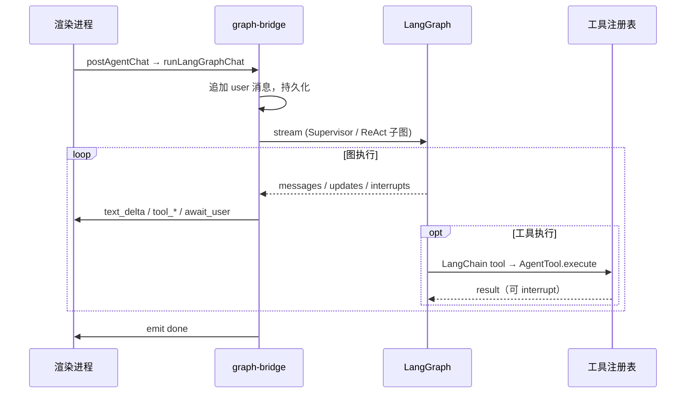

# 灵犀 项目架构

本文档描述灵犀（react-agent）的整体技术架构、模块划分与扩展方式。面向需要二次开发或排查问题的开发者。

---

## 1. 架构总览

灵犀是典型的 **Electron 三进程桌面应用**：主进程负责 Agent 推理、工具执行与浏览器自动化；渲染进程负责 React UI；preload 脚本通过 `contextBridge` 暴露安全的 IPC API。

```
┌──────────────────────────────────────────────────────────────────────┐
│                         渲染进程 (React)                              │
│  AppShell ─ features/chat|publish|schedule|skills|settings|browser   │
│       │                                                              │
│       │  window.api.* (preload)                                      │
└───────┼──────────────────────────────────────────────────────────────┘
        │ IPC invoke / event push
┌───────┼──────────────────────────────────────────────────────────────┐
│       ▼              主进程 (Node.js)                                 │
│  ipc.ts ── store/* (JSON 持久化)                                     │
│       │                                                              │
│       ├── agent/                                                     │
│       │    ├── graph-bridge.ts   # 聊天/步骤入口；LangGraph ↔ Event  │
│       │    ├── graph/            # chat 多智能体 + ReAct 子图         │
│       │    ├── llm-langchain.ts  # ChatOpenAI → DashScope            │
│       │    └── tools/*           # AgentTool 注册表 + LC 适配          │
│       │                                                              │
│       ├── workflow/                                                  │
│       │    ├── compile-to-langgraph.ts  # Definition → StateGraph    │
│       │    └── engine.ts                # Run 生命周期 + 节点执行复用 │
│       │                                                              │
│       ├── browser/service.ts (Playwright…)                           │
│       └── schedule/scheduler.ts                                      │
└──────────────────────────────────────────────────────────────────────┘
        │
        ▼
  userData/react-agent-data/   （settings、sessions、plans、profile…）
```

### 设计原则

| 原则 | 实现 |
|------|------|
| LangGraph 编排 | 聊天 Supervisor 多角色 + 工作流 `compile-to-langgraph`；无 runtime 切换 |
| 工具即能力边界 | 新增功能优先注册 `AgentTool`，经适配器进 LangChain；不改 Bridge 核心 |
| 事件兼容 | 仍推送 `event:agent`（text_delta / tool_* / await_user / done） |
| 无数据库 | 全部数据 JSON 落盘到 `userData`；图 checkpoint 进程内 MemorySaver |
| 契约共享 | `shared/types.ts` 定义 IPC 通道与实体类型，主/渲染两端共用 |
| 按业务域拆分 | 前端 `src/features/*`，每个 feature 含 components / hooks / api |

---

## 2. 目录结构

```
react-agent/
├── electron/
│   ├── main/
│   │   ├── index.ts              # 应用入口：窗口、IPC、调度器
│   │   ├── ipc.ts                # IPC handler 注册
│   │   ├── window.ts             # 主窗口引用（事件推送）
│   │   ├── agent/
│   │   │   ├── graph-bridge.ts   # 聊天/步骤入口；stream → AgentEvent
│   │   │   ├── llm-langchain.ts  # ChatOpenAI（DashScope）唯一工厂
│   │   │   ├── graph/            # 状态、角色提示、chat_graph、react 子图
│   │   │   └── tools/            # 工具注册表 + langchain-adapter
│   │   │       ├── index.ts
│   │   │       ├── types.ts
│   │   │       └── …
│   │   ├── browser/
│   │   │   ├── service.ts        # Playwright 服务单例
│   │   │   ├── human-input.ts    # 拟人交互
│   │   │   ├── profile-lock.ts   # SingletonLock 清理
│   │   │   ├── xhs-dom.ts        # 小红书 DOM 选择器
│   │   │   ├── xhs-publish.ts    # 小红书发布脚本
│   │   │   ├── douyin-dom.ts
│   │   │   └── douyin-publish.ts
│   │   ├── store/                # JSON 持久化层
│   │   │   ├── paths.ts          # userData 路径
│   │   │   ├── settings.ts
│   │   │   ├── sessions.ts
│   │   │   ├── plans.ts
│   │   │   ├── schedules.ts
│   │   │   ├── resources.ts      # 技能/规则资源路径与初始化迁移
│   │   │   ├── skills.ts
│   │   │   ├── rules.ts
│   │   │   └── skill-import.ts
│   │   └── schedule/
│   │       ├── scheduler.ts      # 定时轮询
│   │       └── agent-hook.ts     # Agent 完成回调
│   └── preload/
│       └── index.ts              # contextBridge 暴露 window.api
├── src/                          # 渲染进程（React）
│   ├── App.tsx                   # 根编排：hydrate + 事件订阅
│   ├── layouts/AppShell/         # 壳层：侧栏 + 主内容路由
│   ├── features/
│   │   ├── chat/                 # 聊天、会话、Agent 事件
│   │   ├── publish/              # 发布工作台
│   │   ├── schedule/             # 定时任务
│   │   ├── skills/               # 项目技能市场
│   │   ├── settings/             # 应用设置
│   │   └── browser/              # 智能体浏览器预览
│   └── stores/app-store.ts       # 全局视图状态 (view)
├── shared/                       # 主/渲染共享
│   ├── types.ts                  # IPC 通道、实体、AgentEvent
│   ├── publish-channels.ts       # 发布渠道注册表
│   ├── publish-prompt.ts         # 发布计划 → Agent 指令
│   └── schedule-utils.ts         # 下次执行时间计算
├── resources/
│   ├── skills/                   # 技能市场与 Agent 技能
│   └── rules/                    # MDC 持久规则
├── scripts/install-browser.mjs   # Playwright 国内镜像安装
└── doc/                          # 项目文档
```

---

## 3. 进程通信（IPC）

### 3.1 通道命名约定

定义于 `shared/types.ts` 的 `IpcChannels`：

- **读操作**：`query:*`（如 `query:settings`、`query:sessions`）
- **写操作**：`post:*`（如 `post:settings`、`post:agent:chat`）
- **事件推送**（主 → 渲染）：`event:*`（如 `event:agent`、`event:browser-frame`）

### 3.2 Preload 桥接

`electron/preload/index.ts` 通过 `contextBridge.exposeInMainWorld('api', …)` 暴露 `ElectronApi` 接口。渲染进程只通过 `window.api` 访问主进程，不直接 `require('electron')`。

### 3.3 事件流

Agent 执行过程中的状态通过 `webContents.send('event:agent', event)` 推送到渲染进程：

```typescript
type AgentEvent =
  | { type: 'text_delta'; ... }      // 流式文本
  | { type: 'message'; ... }         // 完整消息落盘
  | { type: 'tool_start'; ... }      // 工具开始
  | { type: 'tool_result'; ... }     // 工具结果
  | { type: 'task_update'; ... }     // 任务清单更新
  | { type: 'await_user'; ... }      // 等待用户（登录/确认）
  | { type: 'browser_open'; ... }    // 浏览器导航
  | { type: 'done'; ... }            // 本轮结束
  | { type: 'error'; ... }           // 错误
```

渲染进程在 `useSessionStore.bindAgentEvents()` 中订阅并更新 UI。

---

## 4. Agent 编排（LangGraph）

核心文件：`electron/main/agent/graph-bridge.ts`

### 4.1 执行流程



### 4.2 系统提示

角色提示在 `graph/prompts.ts`；规则与项目技能在构图时注入。工作流单步走受限 ReAct 子图（`buildStepReactGraph`）。

### 4.3 会话控制

| 机制 | 说明 |
|------|------|
| `abortMap`（graph-bridge） | 每会话一个 `AbortController`，IPC `postAgentAbort` → `postGraphAbort` |
| LangGraph `interrupt` | 登录/确认等待；IPC `postAgentContinue` → `postGraphContinue` / `Command({ resume })` |
| `maxTurns` | 设置页可配，防止无限工具循环 |

### 4.4 LLM 层

`electron/main/agent/llm-langchain.ts` 使用 `@langchain/openai` 的 `ChatOpenAI`，指向百炼兼容端点；技能导入等非编排调用也经此工厂。

---

## 5. 工具注册表

定义于 `electron/main/agent/tools/`，通过 `getAllTools()` 统一注册。

### 5.1 当前工具列表

| 工具名 | 模块 | 用途 |
|--------|------|------|
| `list_attachments` | file-tools | 列出用户本轮上传的附件 |
| `read_file` / `write_file` | file-tools | 读写 artifacts 目录 |
| `update_task_list` | xhs-tools | 更新聊天区任务清单 |
| `fetch_web_images` | xhs-tools | 从网页下载配图 |
| `browser_navigate` | browser-tools | 导航到 URL |
| `browser_snapshot` | browser-tools | 获取页面可访问性快照 |
| `browser_click` / `browser_type` | browser-tools | 拟人点击/输入 |
| `browser_upload` | browser-tools | 文件上传 |
| `browser_wait` | browser-tools | 等待页面变化 |
| `xhs_publish_note` | xhs-tools | 小红书图文发布（高层技能） |
| `douyin_publish_note` | douyin-tools | 抖音图文发布（高层技能） |

### 5.2 工具接口

```typescript
interface AgentTool {
  name: string
  description: string
  parameters: JSONSchema
  execute(args: unknown, ctx: ToolContext): Promise<ToolResult>
}

interface ToolContext {
  sessionId: string
  emit: (event: AgentEvent) => void
  settings: AppSettings
}
```

`ToolResult` 可包含 `awaitUser: true`，loop 会 emit `await_user` 并挂起直到用户继续。

### 5.3 扩展新工具

1. 在 `electron/main/agent/tools/` 新建模块，实现 `AgentTool`。
2. 在 `tools/index.ts` 的 `getAllTools()` 中追加。
3. 若需新渠道，同步更新 `shared/publish-channels.ts` 并实现对应 `*-publish.ts`。
4. 在 `.cursor/skills/` 添加领域技能文档（可选，帮助 Agent 正确使用）。

---

## 6. 浏览器服务

核心文件：`electron/main/browser/service.ts`

### 6.1 设计要点

- **持久化上下文**：`chromium.launchPersistentContext(userData/browser-profile)`，Cookie 跨会话保留。
- **有头模式**：`headless: false`，便于用户扫码登录与人工介入。
- **截帧推送**：定时 `page.screenshot()` → `event:browser-frame` → 渲染进程预览面板。
- **锁清理**：启动前 `releaseBrowserProfileLock()` 清理 `SingletonLock` 与残留 Chrome 进程。
- **拟人交互**：`human-input.ts` 模拟真实鼠标移动与打字间隔，降低反爬检测。

### 6.2 发布脚本分层

```
xhs_publish_note (工具入口)
    └── xhs-publish.ts (业务流程：导航→填表→上传→发布)
            └── xhs-dom.ts (DOM 选择器，平台改版时主要改这里)
            └── service.ts (底层 page 操作)
            └── human-input.ts (拟人点击/打字/上传)
```

抖音同理：`douyin-publish.ts` + `douyin-dom.ts`。

---

## 7. 数据持久化

### 7.1 存储位置

`electron/main/store/paths.ts` 定义根目录：

```
userData/react-agent-data/
├── settings.json
├── sessions/<id>.json
├── publish-plans/<id>.json
├── scheduled-tasks/<id>.json
├── browser-profile/          # Playwright Profile
└── artifacts/                # Agent 产出文件
```

### 7.2 Store 层约定

| 模块 | 读 | 写 |
|------|----|----|
| settings | `querySettings` | `postSettings` |
| sessions | `querySessions` / `querySession` | `postSession` / `postDeleteSession` |
| plans | `queryPublishPlans` / `queryPublishPlan` | `postPublishPlan` / `postDeletePublishPlan` |
| schedules | `queryScheduledTasks` / `queryScheduledTask` | `postScheduledTask` / `postDeleteScheduledTask` |
| skills | `queryProjectSkills` | `postProjectSkill` / `postDeleteProjectSkill` |

每个 store 模块负责 JSON 读写，无 ORM。

---

## 8. 前端架构

### 8.1 视图路由

`stores/app-store.ts` 维护 `view: AppView`：

```typescript
type AppView = 'chat' | 'publish' | 'schedule' | 'skills' | 'settings'
```

`AppShell` 根据 `view` 渲染对应 feature 页面；侧栏 `useSidebarNavigation` 负责切换。

### 8.2 Feature 模块结构

以 `src/features/chat` 为例：

```
chat/
├── index.ts              # 对外导出
├── types.ts              # feature 局部类型
├── api.ts                # window.api 封装
├── hooks/
│   └── useSessionStore.ts  # Zustand store
└── components/
    ├── ChatPage/
    ├── ChatInput/
    ├── MessageList/
    ├── TaskChecklist/
    └── WelcomeHero/
```

各 feature 遵循相同模式：`api.ts` 封装 IPC → `hooks/*Store.ts` 管理状态 → `components/` 纯 UI。

### 8.3 状态管理

使用 **Zustand** 按域拆分 store：

| Store | 职责 |
|-------|------|
| `useAppStore` | 当前视图 |
| `useSessionStore` | 会话列表、消息、Agent 运行状态 |
| `useSettingsStore` | 应用设置 |
| `usePublishStore` | 发布计划 CRUD |
| `useScheduleStore` | 定时任务 CRUD + 调度事件 |
| `useSkillsStore` | 项目技能 CRUD |
| `useBrowserControl` | 浏览器预览状态 |

`App.tsx` 在 `useEffect` 中统一 hydrate 并订阅 Agent / Schedule 事件。

---

## 9. 发布与调度

### 9.1 发布渠道注册表

`shared/publish-channels.ts` 统一管理渠道元数据：

```typescript
interface PublishChannelMeta {
  id: PublishChannelId       // 'xhs' | 'douyin' | 'wechat_channels'
  label: string              // 展示名
  enabled: boolean           // 工作台是否可选
  publishTool: string        // Agent 工具名
  titleMaxLength?: number
  agentHint: string          // 注入 prompt 的补充说明
}
```

新增渠道只需追加 `PUBLISH_CHANNELS` 并实现对应 publish 工具。

### 9.2 发布计划 → Agent 指令

`shared/publish-prompt.ts` 的 `buildPublishPlanPrompt(plan)` 将工作台计划转为结构化 Agent 指令，发布工作台「运行」与定时任务共用此逻辑。

### 9.3 定时调度器

`electron/main/schedule/scheduler.ts`：

- 应用启动时 `startScheduleService()`，每 30 秒 `tick()`。
- 检查 `enabled` 且 `nextRunAt <= now` 的任务。
- 创建 `type: 'schedule'` 会话，调用 `runAgentChat()`。
- `agent-hook.ts` 监听 `done` / `error` 事件，更新 `lastRunStatus` 与 `nextRunAt`。

---

## 10. 项目技能系统

技能文件位于仓库 `resources/skills/<skill-id>/SKILL.md`。开发环境直接维护该目录；安装版首次启动将内置资源补入 `userData/react-agent-data/resources`，后续只读写 userData 副本。

| 能力 | 实现 |
|------|------|
| 列表/详情 | `store/skills.ts` 扫描目录 |
| 启用/禁用 | `skill-states.json` 记录开关 |
| 注入提示 | `queryEnabledSkillPrompt()` 拼接已启用技能正文 |
| 市场资源 | 内置 `resources/skills/` |
| 链接导入 | `store/skill-import.ts` |

渲染进程 **技能** 页提供可视化管理；Agent 运行时自动读取启用状态。

规则维护使用 `resources/rules/*.mdc`，启停状态写入 `alwaysApply` frontmatter；旧版 `rules.json` 仅在启动时迁移，源文件保留。

---

## 11. 构建与别名

`electron.vite.config.ts` 配置三端构建：

| 端 | 入口 | 说明 |
|----|------|------|
| main | `electron/main/index.ts` | Node 环境，externalize 依赖 |
| preload | `electron/preload/index.ts` | 桥接脚本 |
| renderer | `src/index.html` | React SPA |

渲染进程别名：

- `@` → `src/`
- `@shared` → `shared/`

---

## 12. 扩展指南

### 12.1 新增发布渠道（如视频号）

1. `shared/publish-channels.ts` 追加渠道，`enabled: true`。
2. 实现 `electron/main/browser/wechat-dom.ts` + `wechat-publish.ts`。
3. 实现 `electron/main/agent/tools/wechat-tools.ts`，注册 `wechat_channels_publish_note`。
4. 在 `tools/index.ts` 注册。
5. 添加 `.cursor/skills/react-agent-wechat-publish/SKILL.md` 领域文档。

### 12.2 新增 Agent 工具

1. 在 `electron/main/agent/tools/` 实现 `AgentTool`。
2. 注册到 `getAllTools()`。
3. 视需要在 `BASE_SYSTEM_PROMPT` 或技能中说明用法。

### 12.3 新增前端页面

1. `src/features/<name>/` 按现有 feature 结构创建。
2. `stores/app-store.ts` 的 `AppView` 追加路由值。
3. `AppShell` 侧栏与 `AppMain` 注册入口。

### 12.4 新增 IPC 通道

1. `shared/types.ts` 追加 `IpcChannels` 与类型。
2. `electron/main/ipc.ts` 注册 handler。
3. `electron/preload/index.ts` 暴露方法。
4. 渲染进程 `api.ts` 封装调用。

---

## 13. 相关文档

- [使用手册](./使用手册.md) — 安装、配置、发布流程、FAQ
- [README](../README.md) — 项目概览与快速开始
- `.cursor/skills/react-agent-*/SKILL.md` — 各子系统开发技能
